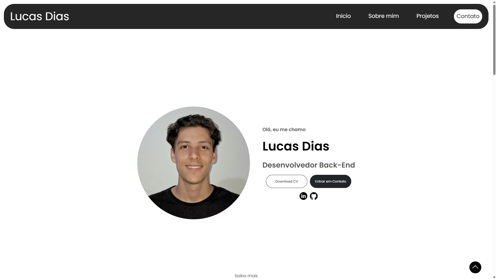
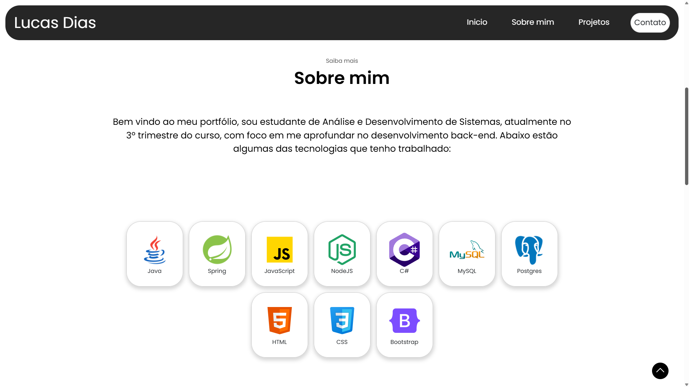
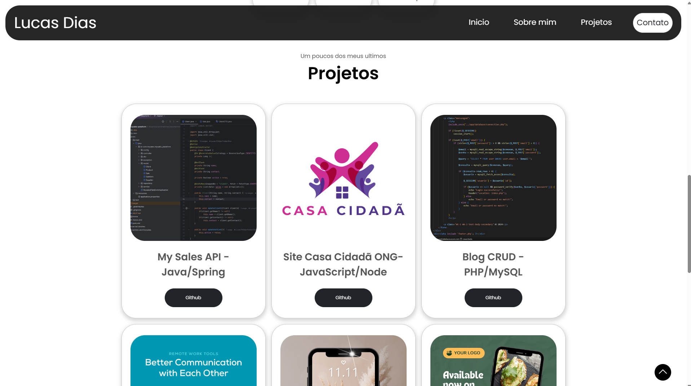
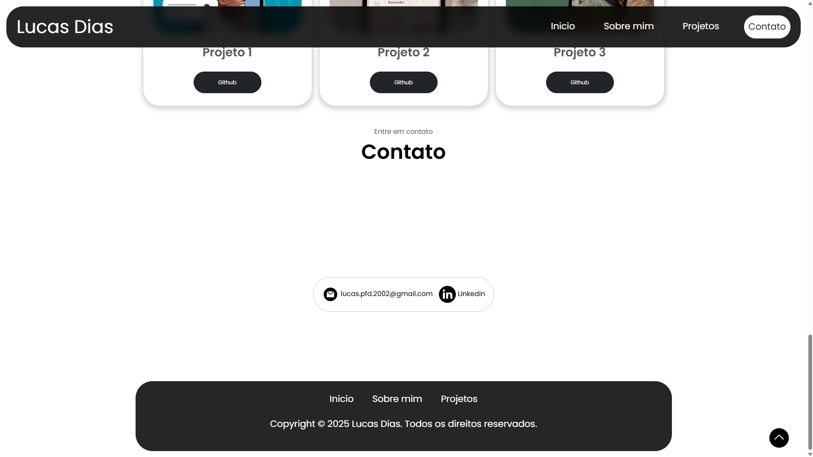
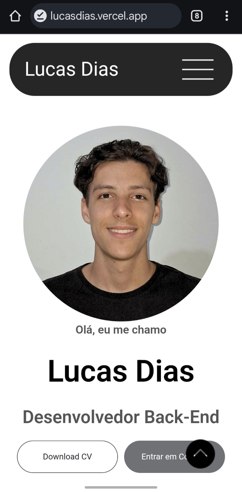
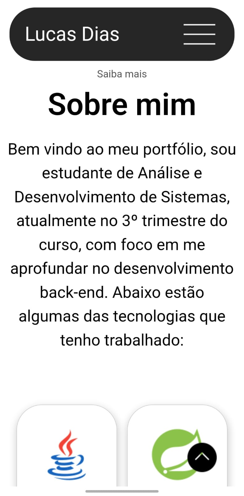
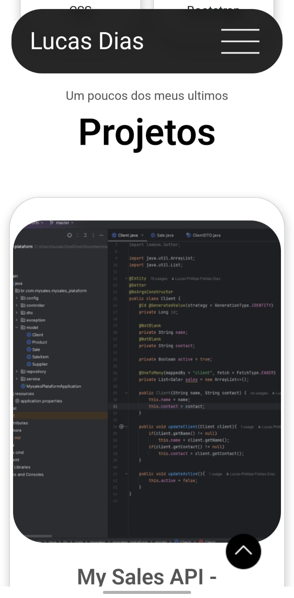
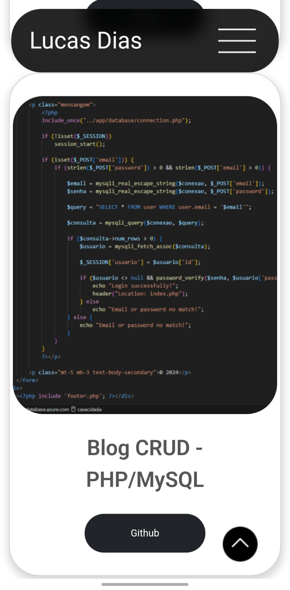

# Portfólio Pessoal

Bem-vindo ao meu portfólio! Este projeto foi criado para trazer visibilidade aos meus projetos pessoais.

Você pode acessar o portfólio online em: [lucasdias.vencel.app](https://lucasdias.vercel.app)

## Tecnologias Utilizadas

- **HTML**: Para a estruturação das páginas.
- **CSS**: Para o design e estilização.
- **JavaScript**: Para interatividade no lado do cliente.
- **Node.js**: Para o servidor back-end.
- **Express**: Framework para simplificar a criação do servidor web.

## Como Rodar

1. Clone o repositório para o seu ambiente local:
   ```bash
   git clone https://github.com/LucasDias2002/lucasdias.git
   ```

2. Navegue até o diretório do projeto:
   ```bash
   cd lucasdias
   ```

3. Instale as dependências do Node.js:
   ```bash
   npm install
   ```

4. Inicie o servidor:
   ```bash
   node index.js
   ```

5. Abra o navegador e vá para [http://localhost:3000](http://localhost:3000) para visualizar seu portfólio.

## Imagens de Demonstração

















